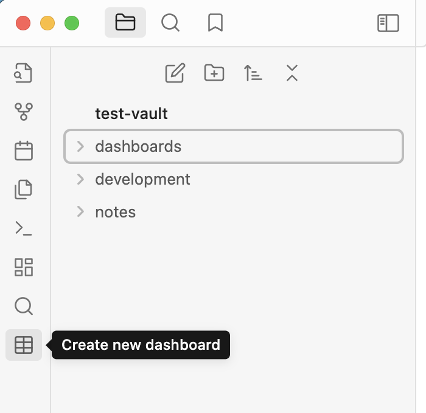
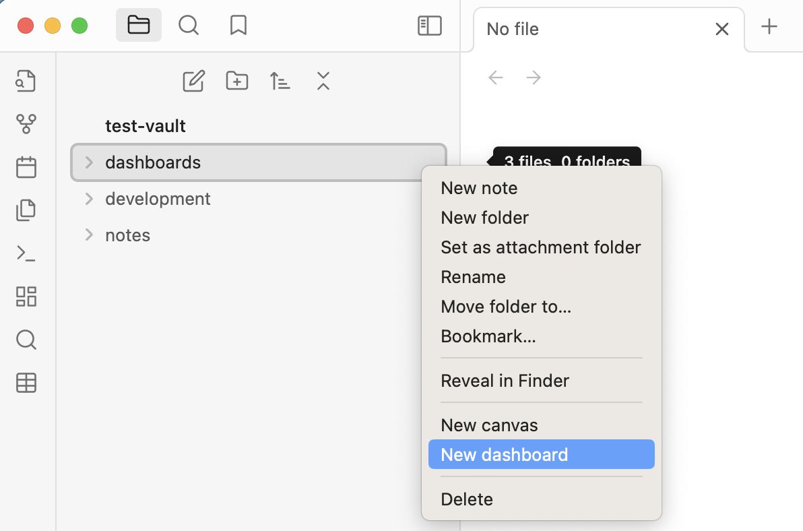

Find detailed documentation at [trey-wallis.github.io/obsidian-dashboards](https://trey-wallis.github.io/obsidian-dashboards)

Dashboards is an [Obsidian](https://obsidian.md/) plugin for desktop and mobile. A dashboard is a higher-level view that allows you to tag, sort, and display feeds from your notes. Dashboards is inspired by [Notion.so](https://www.notion.so/).

Support development

<a href="https://buymeacoffee.com/treywallis" target="_blank" rel="noopener">
</a>

## About

-   [Screenshots](#screenshots)
-   [Installation](#installation)
-   [Getting started](#getting-started)
-   [Issues](#issues)
-   [Contributing](#contributing)
-   [License](#license)
-   [Disclaimer](#disclaimer)

## Screenshots

## Installation

### Installing the plugin

1. In Obsidian, open **Settings**
2. Go to **Community plugins**
3. Select **Browse**
4. Search for **Dashboards** by **Trey Wallis**
5. Select **Install**
6. Then select **Enable**

### Linking dashboard files

By default, Obsidian doesn't display `.dashboard` files in the modal that opens when you type double brackets `[[`. In order to allow this, you must enable detection of all file extensions.

1. In Obsidian, open **Settings**
2. Select **File & Links**
3. Toggle **Detect all file extensions**


## Getting started

Start by creating a new dashboard. You can do this by clicking on the dashboard icon on the sidebar.



You can also right click on a folder and click **New dashboard**



## Roadmap

See our [project roadmap](https://github.com/users/trey-wallis/projects/2) for details on:

-   What is currently in progress
-   What will be worked on next
-   What is waiting to be released

## Issues

Please see [issues](https://github.com/trey-wallis/obsidian-dashboards/issues) for feature requests and bug reports.

If you are experiencing a problem with the plugin, please search the issues for any open bug reports related to your problem before opening a new issue.

## Contributing

Dashboards is a community plugin. Contributions are welcome.

Dashboards is built with [React.JS](https://react.dev/).

### Setting up the project

Please make sure that you install yarn

```shell
npm install --global yarn
```

Install dependencies

```shell
yarn install
```

Create a symbolic link the cloned repository to your Obsidan vault. I recommend making a new Obsidian vault just for testing.

```shell
ln -s /users/trey/dashboards /users/trey/test-vault/.obsidian/plugins/
```

Run the project

```shell
yarn run dev
```

## License

Dashboards is distributed under the [GNU General Public License v3.0](https://github.com/trey-wallis/obsidian-dashboards/blob/master/LICENSE)

## Disclaimer

This plugin extends the functionality of Obsidian.md. Although tested during development, there may still be bugs in the software. I **strongly** recommend you to make frequent backup copies of your vault. I am not responsible for any data that is lost due to usage of this plugin.
