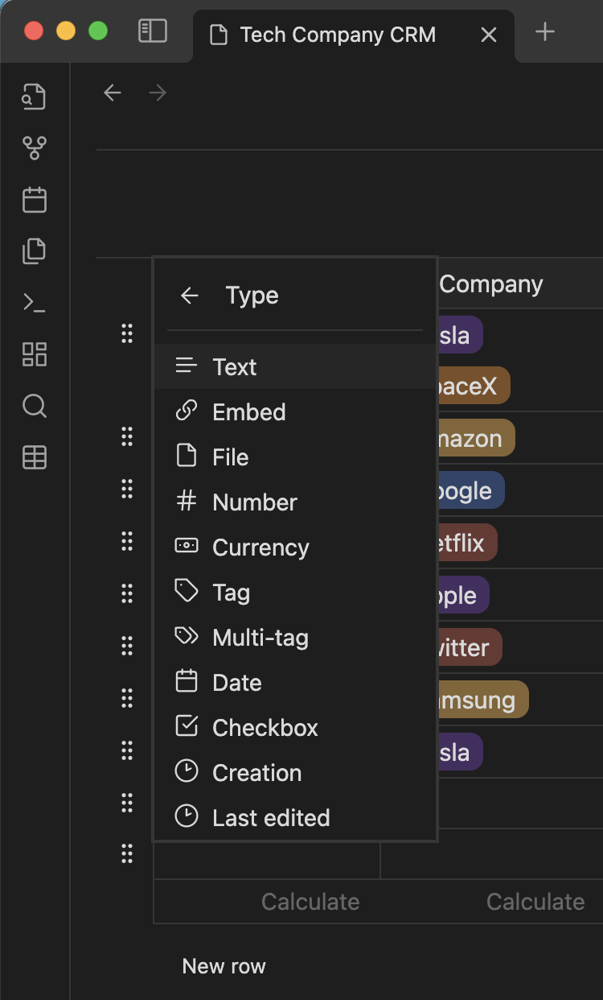
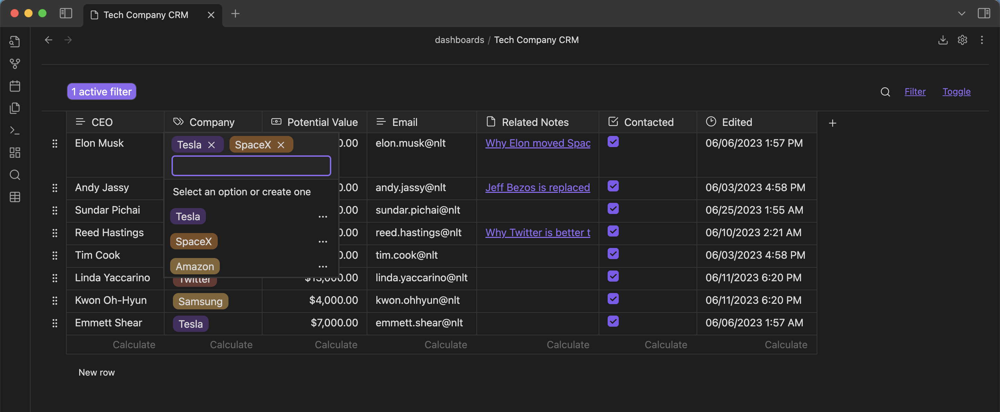
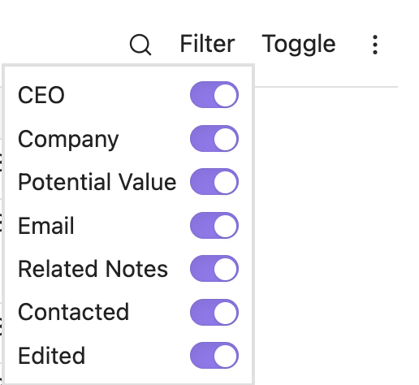
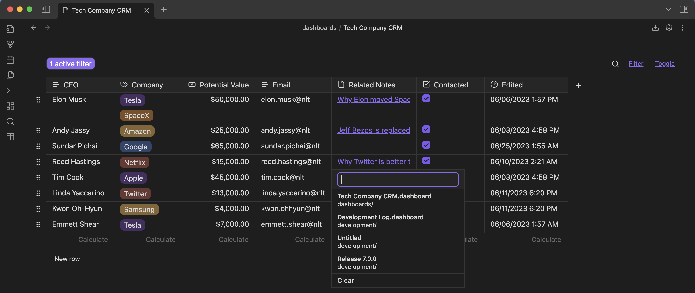
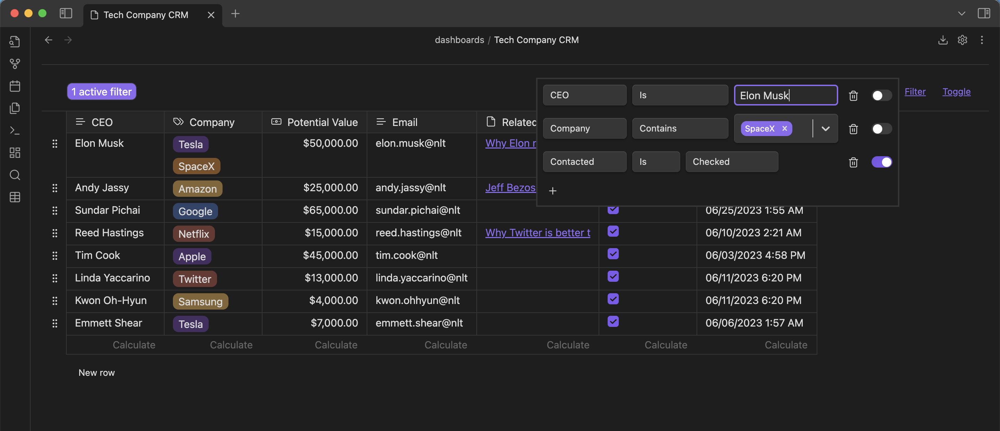

Find detailed documentation at [dataloom.xyz](https://dataloom.xyz)

DataLoom is an [Obsidian.md](https://obsidian.md/) plugin for desktop and mobile. DataLoom allows you to weave together data from diverse sources into a cohesive table view.

Support development

## About

-   [Screenshots](#screenshots)
-   [FAQ](#faq)
-   [Installation](#installation)
-   [Create a new loom](#create-a-new-loom)
-   [Issues](#issues)
-   [Contributing](#contributing)
-   [Network Usage](#network-usage)
-   [License](#license)
-   [Disclaimer](#disclaimer)

## Screenshots

DataLoom supports both light and dark modes and a majority of Obsidian themes.

Choose from 11 different cell types

Notion-like tag menu system

Toggle visibility of different columns

Reference notes directly from the table

Advanced filtering menu

Export to markdown or CSV

Mobile support

## FAQ

### What is the purpose of this plugin?

DataLoom offers an interactive WYSIWYG user interface for managing tabular data. It allows you to quickly create a table, edit data, and filter data based on specific criteria.

### Why is this plugin called DataLoom?

I wanted a name that would convey the functionality of rendering data from different sources.

Development planned for this plugin includes rendering data from both Obsidian sources such as folders or tags, and external sources such as the YouTube or Instagram API.

### What is the difference between DataLoom and Projects?

[Projects](https://github.com/marcusolsson/obsidian-projects) allows you to create projects from folders and Dataview queries. It offers a table, board, calendar, and gallery view for your data.

While Projects focuses on offering views for managing projects, DataLoom focuses on integrating different data sources.

Projects populates table rows based on existing markdown notes. DataLoom populates table rows based on the data that is entered by the user. All data for a table is stored within a `.loom` file. No markdown notes are required to get started with DataLoom.

### What is the difference between DataLoom and DB Folder?

[DB Folder](https://github.com/RafaelGB/obsidian-db-folder) allows you to create a Notion-like database based on folders, links, tags, or dataview queries.

DB Folder is very similar to what DataLoom intends to accomplish.

One major difference between DB Folder and DataLoom is that DataLoom doesn't require a folder. You only need to create a loom file and enter text data to get started.

Another difference is that DataLoom does not depend on [Dataview](https://github.com/blacksmithgu/obsidian-dataview). It can be installed as a standalone plugin.

DataLoom also employs its own menu system rendered in React. This allows for a more complicated user interface.

### What is the difference between DataLoom and Make.MD?

[Make.MD](https://github.com/Make-md/makemd) contains rich features that enhance the native Obsidian UI to be more like Notion.so. While helpful for some users, not every user will want all of these features.

DataLoom intends to be a more simple application. It does not change the native UI of Obsidian. It is a simple React app that runs in its own view. DataLoom also stores data in JSON format in its own `.loom` file.

### Why should I use this plugin?

You should use this plugin if you wish to sort and filter tabular data. I use the plugin as an alternative to making markdown lists. It allows me to add tags to my items and sort my ideas.

I recommend you try out the plugin and see if it can help you in organizing your second brain.

## Installation

### Install the plugin

1. In Obsidian, open **Settings**
2. Go to **Community plugins**
3. Select **Browse**
4. Search for **DataLoom** by **Trey Wallis**
5. Select **Install**
6. Then select **Enable**

### Configure Obsidian

DataLoom saves data in JSON format in `.loom` files.

#### Enable detection of loom files

By default, Obsidian doesn't display `.loom` files in the suggest menu that opens when you type double brackets `[[`. For Obsidian to do this, you must enable the detection of all file extensions.

1. In Obsidian, open **Settings**
2. Select **File & Links**
3. Toggle **Detect all file extensions**

#### Enable syncing of loom files

By default, Obsidian doesn't sync `.loom` files between devices. For Obsidian to do this, you must enable syncing of all file extensions.

1. In Obsidian, open **Settings**
2. Select **Sync**
3. Choose and connect to a remote vault
4. In the remote vault settings, Toggle **Sync all other types**
5. Repeat these steps on all devices that you want to sync `.loom` files to

## Create a new loom

There are 3 ways to create a new loom

-   Click on the table icon on the sidebar
-   Right-click on any folder and click **New loom**
-   Use the command palette and search for **Create loom**

## Roadmap

See our [project roadmap](https://github.com/users/trey-wallis/projects/2) for details on:

-   What is currently in progress
-   What will be worked on next
-   What is waiting to be released

## Issues

Please see [issues](https://github.com/trey-wallis/obsidian-dataloom/issues) for feature requests and bug reports.

If you are experiencing a problem with the plugin, please search the issues for any open bug reports related to your problem before opening a new issue.

## Contributing

DataLoom is a community plugin. Contributions are welcome.

Please see our [contribution guide](https://github.com/trey-wallis/obsidian-dataloom/blob/master/CONTRIBUTING.md) for details on how to contribute

## Network Usage

According to [Obsidian developer policies](https://docs.obsidian.md/Developer+policies), an Obsidian plugin must explain which network services are used and why.

DataLoom will make one `GET` request to `https://api.github.com/repos/trey-wallis/obsidian-dataloom/releases/latest` to pull the latest release for the What's New Modal. Besides this, DataLoom does not make any network requests. DataLoom does not include client-side telemetry.

## License

DataLoom is distributed under the [GNU General Public License v3.0](https://github.com/trey-wallis/obsidian-dataloom/blob/master/LICENSE)

## Disclaimer

This plugin extends the functionality of Obsidian.md. Although tested during development, there may still be bugs in the software. I **strongly** recommend you to make frequent backup copies of your vault. I am not responsible for any data that is lost due to the usage of this plugin.
