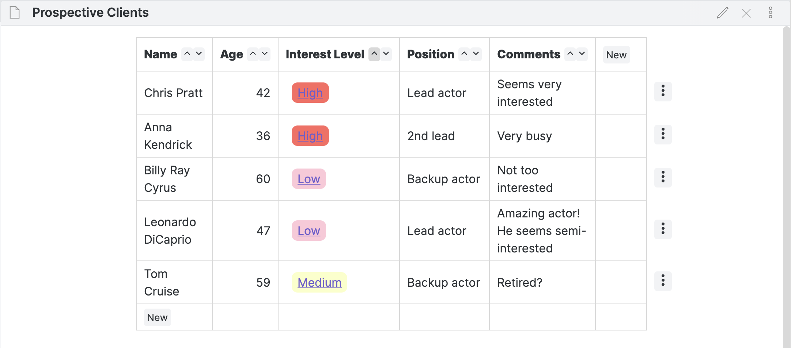
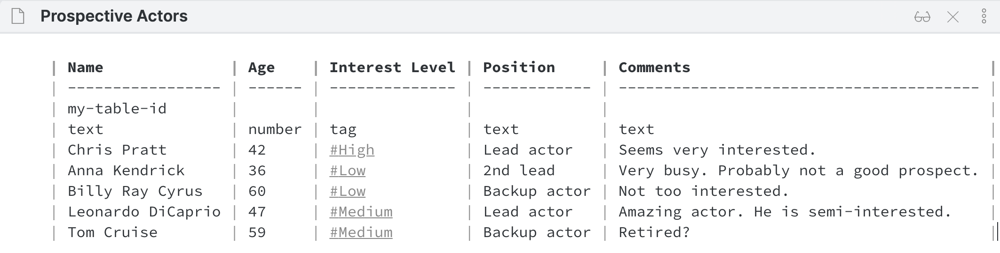
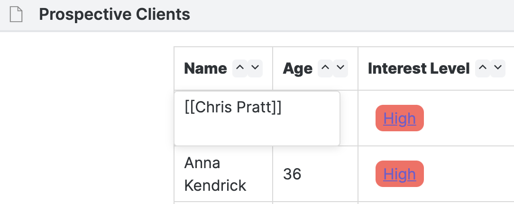
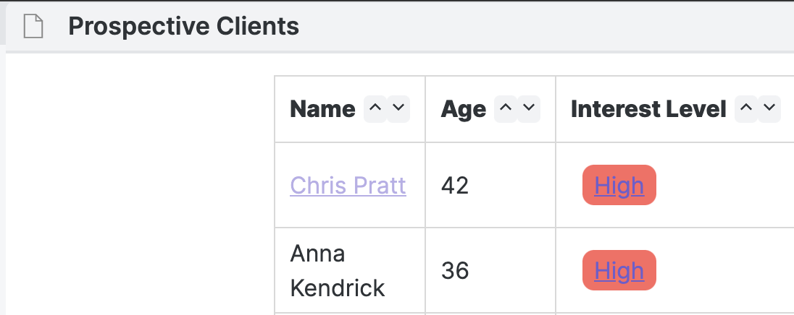

# Obsidian Notion-Like Tables

## About

Obsidian Notion-Like Tables allows you to create markdown tables using an interface similar to that found in Notion.so.

## Roadmap

-   0.1.0
    -   MVP
-   0.2.0
    -   Semantic table tags
-   0.3.0
    -   Notion-Like sort menu
-   1.0.0
    -   Settings cache system to persist app data
    -   Added jest tests
    -   Sorting updates source markdown
-   1.1.0
    -   Support for http/https links
-   1.2.0
    -   UI updates
    -   Insert row above or below an existing row
-   1.3.0
    -   Create new row with keyboard
    -   Add new tag colors
-   1.4.0
    -   Navigate cells with arrow key and tab key
-   1.5.0
    -   TBA

## Usage

### Making a Table via Command

To quickly make a table you can use the add table command. Press `cmd + p` on your keyboard search "Add table".

Note: you must be in editing mode for this command to appear.

Toggle to reading mode and the table will automatically render.

### Making a Table Manually

A Notion-Like Table uses normal Obsidian table markdown syntax with 2 additional rows:

-   A table id row
-   A type definition row

#### Table ID Row

The table id row is a normal markdown row with the first column containing a unique string. This string must be unique per table per file. If you use the same id in another file that's fine. The id is used to map a table to its data in the settings. If you change this id, your table will not be able to find its settings and will create new ones. If you omit this id, your table will not be rendered as an NLT table.

Example row:
| my-table-id | | |

##### Type Definition Row

The type definition row is a normal markdown row with each column defining the type of data you want that column to accept. The plugin currently supports 3 column types: `text`, `number` and `tag`.

### Editing Cells

To edit a cell, just click on it. Changes made to the cell will be propagated to the markdown.

### Headers

Click on a header name to edit the header title and change the column type.

Please do not edit headers in the markdown once you have rendered your table for the first time. These are what are used to identify a unique table. I plan on finding a better system for this, potentially using the line ID of the table in the document. If you have any suggestions for this, please place it in a feature request.

### Links

If you want to render a link in text, just add square brackets [[My Link]].

### Errors

A cell type error will occur if you enter data which doesn't match the column data type. Please correct this error in your markdown to continue.

### Theming

NLT tables uses normal table semantic elements (`table`, `th`, `tr`, `td`, etc) to render. If you wish to edit the display of the table, just style those elements in your CSS.

## Built With

-   [ReactJS](https://reactjs.org/)
-   [TypeScript](https://github.com/microsoft/TypeScript)
-   [Obsidian API](https://github.com/obsidianmd/obsidian-api)

## Development

The app can be development in either Obsidian or in your browser using `react-scripts`.

### Development in Obsidian

Install packages

-   `npm install`

Run development script

-   `npm run dev`

Go to community plugins in Obsidian and disable safe mode.

Create a plugins folder if one doesn't already exist

-   `mkdir /Desktop/my-vault/.obsidian/plugins`

Make a symbolic link between where you cloned the repo and your vault plugins folder

-   `ln -s ./obsidian-collaboration/plugin /Desktop/my-vault/.obsidian/plugins/`

### Development using React Scripts

Install packages

-   `npm install`

Run development server

-   `npm run start`

## Reporting Bugs

If you find a bug, please open an issue. I will try to respond as soon as possible.

## Resources

-   [Obsidian API Documentation](https://github.com/obsidianmd/obsidian-api)
-   [Obsidian Plugin Docs](https://marcus.se.net/obsidian-plugin-docs)

## License

-   GNU GPLv3

## Author

-   Trey Wallis

## Donate

-   If you find this plugin helpful, please consider [buying me an herbal tea](https://www.buymeacoffee.com/treywallis) ;)
